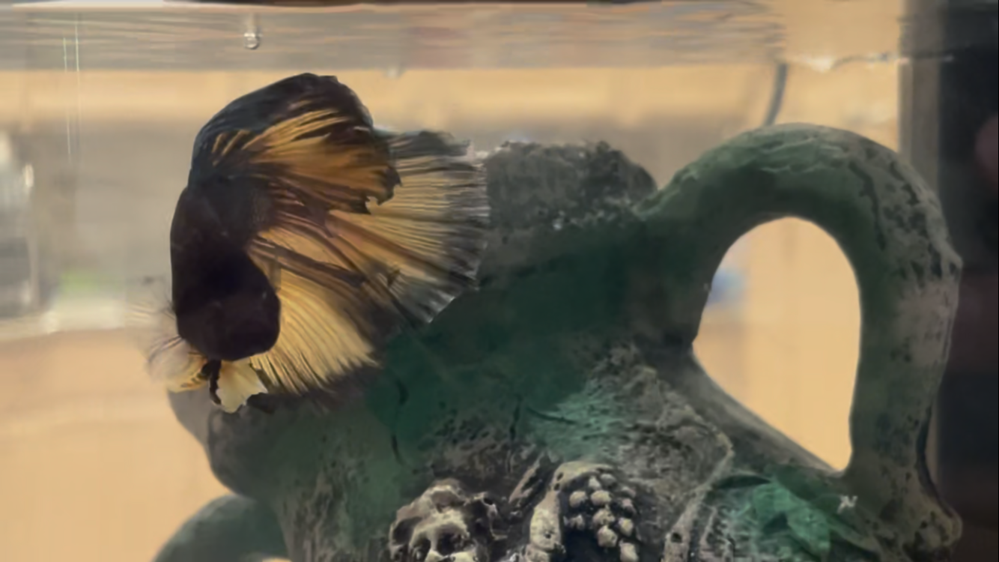

# Tuchi - The Fish Tank of José Ramon

**Tuchi** (**José Ramon Tuchi Bumble Bee**) is a male bumble bee [betta fish](https://en.wikipedia.org/wiki/Siamese_fighting_fish). He lives in Lake Worth, Florida. Tuchi is about 3 months old now (Aug 2023) and might live for another 1-2 years.

  - [Personality](#personality)
  - [Tank Parameters](#tank-parameters)
  - [Cleaning the tank](#cleaning-the-tank)
  - [Signs of stress](#signs-of-stress)
  - [Page Url](#page-url)

## Personality

Social. In general, he will come up to see who is at his tank. He can recognize voice pitches. If he is hiding in the back behind his house (or, away from viewer), he is overexcited or stressed. When he is happy, he blows bubbles at the surface. He likes to exercise in the current in front of the filter.

Clever, but not too smart. Sometimes he gets confused, especially during feeding. However, he can generally figure out what is going on if you give him time.

Friendly. If you put your finger in the tank and hold it still, he will come up to inspect it. If he is in a normal mood, he will swim by and let his fins brush your finger. When he is at the top of the water, you can also pet him in this way, gently. The more you pet him, the more he will be used to it. Do not pet him too much or he can get sick, even if he wants to keep playing.

Goofy. Sometimes he will be vertical in the back, just chilling. It's normal (for him). He likes to twist his body up and down and flop around his tank. He does spins and somersaults while he twists around. (Note however his *bouyancy* should be always normally horizontal - not tilting.)

His tank weighs 1.2 Gal or 10 lbs, so he can be moved for company (his or yours).

At night, he usually sleeps in front of the top entrance of his house.

## Tank Parameters

| Parameter | Value | Note |
| ---- | ---- | ---- |
| Temperature | 73-83 F | In Florida, this means he generally doesn't need a heater. Be careful during winter; if it gets too cold, he can get sick and die. He can handle warmer better.|
| Lighting | 4-5 hours a day | If it's cloudy, you can turn on the light during the day. You can also turn it on at night. Try to use it less than 4-5 hours per day, or you can cause algae growth. |
| Feeding | 3 times a day, 5-7 pellets | Turn the filter off to feed him or the food will get lost and rot. Feed him 1 piece at a time or the food will get lost and rot. Like chickens, his stomach is under his chin. If it is puffed out, he is full. Drop the food in front of him. He will eat more than he should if you keep feeding him, so try not to overfeed him. |
| Filter | Unless feeding. Clean 1 a month with **tank water.** | The filter should just gently break the water to allow for oxygen circulation. Bettas can breath from the air directly, so he will not drown, but poor water quality can get him sick.|

## Cleaning the tank

His waste and rotting food increase the level of nitrogen (in the form of ammonia, nitrites, and nitrates) in the tank. This will reduce his health and mood and at high enough levels, kill him. Cloudy water may just have floating particulate and be fine.

For his size, this tank is *plenty* large (the aquarium is not "overstocked"). So, if you forget a water change or two, he will be fine. It may reduce his lifespan, depress his mood, and make his coloring less vibrant, though.

### New water

**Dechlorinate.** Allow to sit, if time provides, for 48 hours and it will naturally dechlorinate - the chlorine will evaporate.

Apply light conditioner if desired. Fresh and cleanly captured rainwater is an excellent substitute - be careful to not introduce particulate or parasites into the tank.

Note that tank water with fish in it, and without a heater, will be warmer than room temperature water. Especially if the water has been left in a cool place to sit. Likewise, water left in light may be warmer and lessen in volume as it evaporates.

### Doing a water change

1. Clip a hose at the level below the filter.
1. Start the siphon.
1. If you come back before the siphon ends, you can move the hose to the new water and it will auto start. If you come after the siphon ended, you will have to retart the siphon.
1. Sometimes he likes to play in the new water as it comes in.

You should change his water after when he is well fed. After changing, you can leave the lights off as he relaxes.

The main reason the water is changed gradually is to allow the temperature to level out gradually. It is also less traumatic to perform water changes slowly.

## Signs of stress

* Hiding
* Constantly swimming with his face pressed against the tank ("glass surfing")
* Frequently snapping his body at the jewels, plants, or other things in the tank ("flashing")
* Poor appetite
* Trouble staying flat (right-side up)

If you suspect he is sick you can take him to a pet store with a good aquatic specialist to diagnose. He may require medicine for his tank water.

## Page Url

